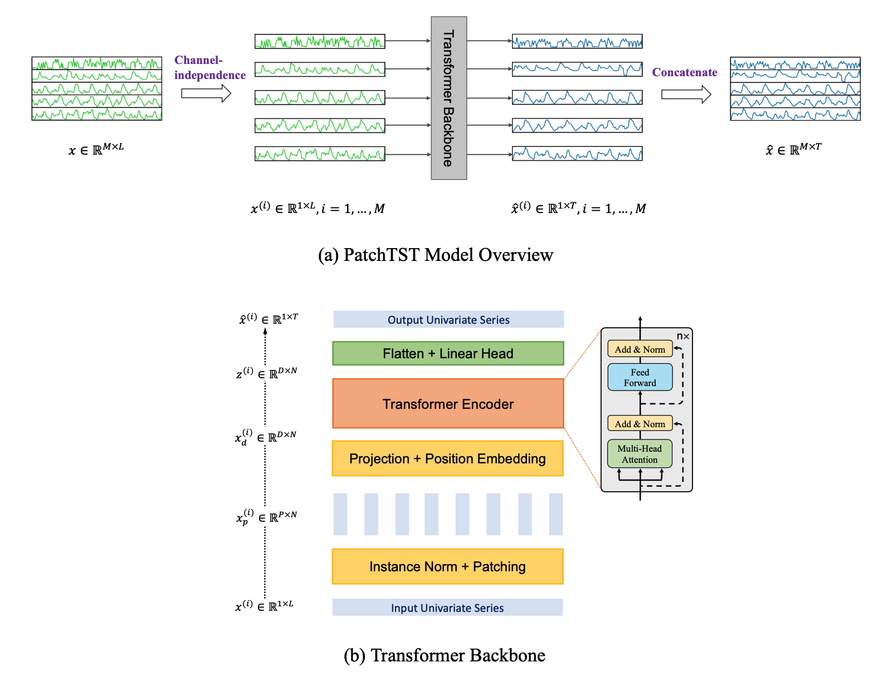
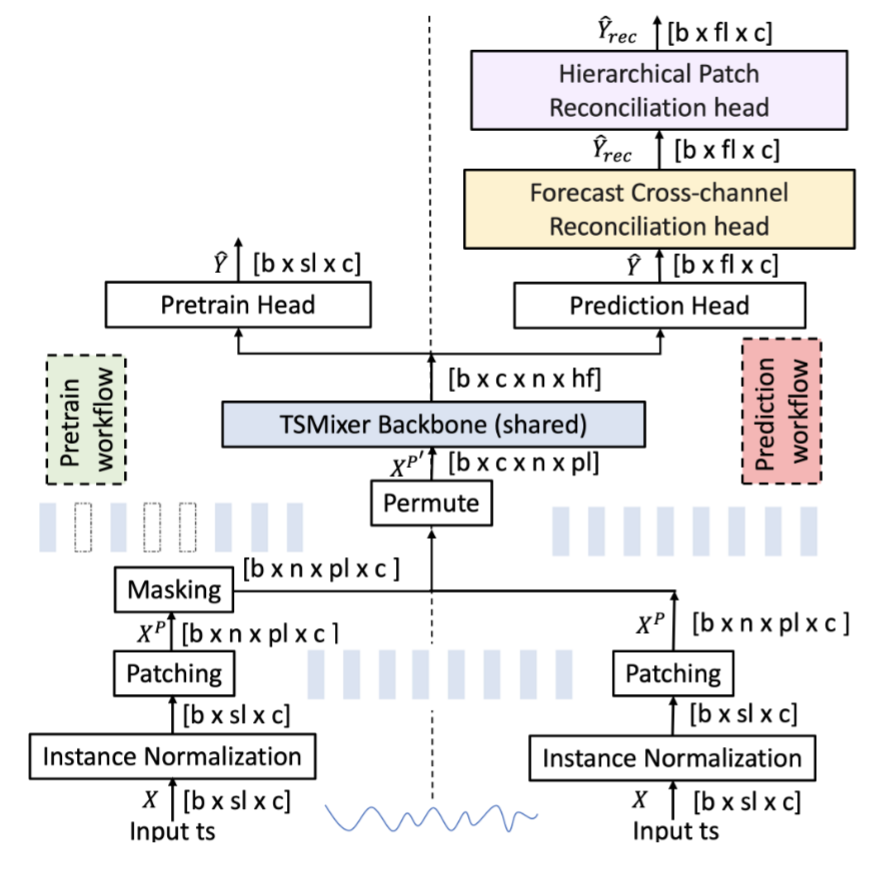

## Table of Contents

1. [Introduction](#introduction)  
 1.1 [Research Methodology](#research-methodology)  
2. [Relevant Models](#relevant-models)  
 2.1 [IBM Granite - General Overview](#ibm-granite---general-overview)  
  2.1.1 [Granite TinyTimeMixers](#granite-tinytimemixers)  
  2.1.2 [Granite TSPulse](#granite-tspulse)  
  2.1.3 [Grasnite PatchTST](#grasnite-patchtst)  
  2.1.4 [Granite PatchTSMixer](#granite-patchtsmixer)  
  2.1.5 [Granite FlowState](#granite-flowstate)  
  2.1.6 [Granite Geospatial Biomass](#granite-geospatial-biomass)  
 2.2 [Smart Farming Disease Detection Transformer](#smart-farming-disease-detection-transformer)  
 2.3 [PlantCaduceus](#plantcaduceus)  
 2.4 [Fruits and Vegetables Detector](#fruits-and-vegetables-detector)  
 2.5 [Plant leaf Detection and Classification](#plant-leaf-detection-and-classification)  
 2.6 [Plant Disease Detection Project](#plant-disease-detection-project)  
 2.7 [Plant Leaf Diseases Detection](#plant-leaf-diseases-detection)  
 2.8 [Fine-Grained Visual Classification on Plant Leaf Diseases](#fine-grained-visual-classification-on-plant-leaf-diseases)  
 2.9 [Timeseries Anomaly Detection](#timeseries-anomaly-detection)  
3. [Non-relevant Models](#non-relevant-models)  
 3.1 [OpenMed NER](#openmed-ner)  
 3.2 [PlanTL models](#plantl-models)  
 3.3 [Others](#others)  
4. [References](#references)

# 1. Introduction

TODO

FARM-TECH is a research project developed by Smart Shaped and Trace Technologies, financed by Ministry of University and Research, with University of Sannio involved as external consultant.  
We have been tasked with identifying the best practises for creating a ML model and correspondent MLOps pipeline to perform analysis and forecasting based on the data produced by sensors and drone analysis involved in the project

## 1.1 Research Methodology

TODO

Dr. Federica Pepe (?) compiled a list of pre-trained model following certain requirements [poi li listo] for the purpose of [TODO].
Additionally, in order to be considered in the scope of this thesis, each model:
1. must be properly documented, and
2. must be relevant to the field of application. 

A [Google Spreadsheet](https://docs.google.com/spreadsheets/d/17MHOh_VFrFM3qAwXw3VAOcdX4I0mnw9C517qEQdEdTg/edit?usp=sharing) has been compiled to keep track of all the models cited in this work.  
The models that satisfy both requirements, labeled as "accepted", will be analysed in-depth in chapter two; models that satisfy only requirement 2, labeled as "discarded (not relevant)", will receive a brief overview, alongside their reason for exclusion, in chapter three; models that do not satisfy the first requirement will not be considered for this thesis (analysis/research?).

# 2. Relevant Models

This chapter will analyse all the models deemed relevant to the FARM-TECH project. Most of these models are general-purpose, time-series forecasting models which, while not trained specifically on relevant data, can be re-trained to better fit the intended purposes.
Out of 100 models originally retrieved, 16 of them are considered as relevant for [this work?]; of these, 7 are part of the IBM Granite suite.

## 2.1 IBM Granite - General Overview

IBM Granite is a family of enterprise-grade AI foundation models developed by IBM, designed to deliver high performance, safety, and efficiency across a wide range of business tasks. These multimodal models support language, vision, speech, and time-series forecasting. Within the Granite suite, these last time-series forecasting models can be of particular importance to FARM-TECH, for example in estimating weather pattern and crop yield [idk].

### 2.1.1 Granite TinyTimeMixers
Granite TinyTimeMixers (TTM) are lightweight, efficient time-series forecasting models within the IBM Granite suite. They are designed to handle large-scale, multivariate time-series data, making them suitable for applications such as sensor data analysis and predictive maintenance in smart farming.

[TODO overview dell'architettura]  
lightweight as in they have less than a bilion parameters

Granite TTMs are available in two main revisions, named as r1 and r2. While architectully identical, TTM r2 models have been pre-trained on larger datasets (~700M samples) than r1 models ( ~250M); IBM reports that with a larger training set, performances have increased by over 15% on average, although they still advise to experiment with both r1 and r2 models to pick the best-suited for the intended application.

Granite TinyTimeMixers provide a valid solution for time-series forecasting in smart farming, and the vast documentation provided by IBM would greatly simplify and speed up the process of introducing these models in a live application.

### 2.1.2 Granite TSPulse
Also part of the IBM Granite suite are the TSPulse models, ultra-compact pre-trained models developed for tasks such as classification, anomaly detection (AD), imputation, and similarity search in multivariate time-series. Their main strength comes from their very limited size, totaling at 1 milion parameters, compared to other multivariate time-series analysis models such as Google's TimesFM (200M parameters) [], Amazon's Chronos models (20M for the smallest) [] and even Lag-LLaMA (2.49M) [], allowing these models to perform GPU-free inference.

[TODO overview dell'architettura]  
At the task level, TSPulse integrates several innovations:

* TSLens: A fine-tuning module for task-aware feature extraction.
* Multi-head triangulation: Fuses outputs from multiple prediction streamsto enhance anomaly detection robustness.
* Hybrid masking: Reduces bias during pre-training, improving zero-shotimputation.  

^rubato dal loro readme

Three variants of TSPulse exist, each specialised in a different task:
* tspulse-hybrid-allhead-512-p8-r1, recommended for anomaly detection
* tspulse-hybrid-dualhead-512-p8-r1, recommended for imputation and search
* tspulse-block-dualhead-512-p16-r1, recommended for classification

The terms "hybrid" and "block" represent the type of masking used during pre-training; "allhead" and "dualhead" specify which heads were enabled during pre-training, with "dualhead" meaning that only time and prob heads were enabled; 512 is the base context length of each model; the number following "p" represents the time-series patches' lenght during training. [poi ci metto l'architettura ed avrà più senso]

In conclusion, thanks to their compact architecture and strong benchmark performance, TSPulse models represent a valid choice for anomaly detection tasks in smart farming. Their small parameter count enables efficient, resource-light deployment, while mantaining a high degree of efficency compared to state-of-the-art models.

## 2.1.3 Grasnite PatchTST
Like TTMs, PatchTST [] is a transformer-based model for tasks related to multivariate time-series, such as forecasting, regression and classification.  
PatchTST introduces two key concepts:
* Patching, which consists in aggregating several time steps into subseries-level short contiguous segments called patching.
* Channel-independence: a multivariate time series is a multi-channel signal, which can be aggregated into a single data point to serve as input token for the Transformer; channel-independence, instead, means that each input token contains information from a single channel.

The purpose of these two ideas are mainly three: (i) a reduction on time and space complexity, since patching will reduce the amount of input tokens fed to the Transformer, this will be seen more in detail later; (ii) increased locality and capture of comprehensive semantic information that would be missed in point-level evaluation, and (iii) the separate per-channel attention would increase adaptability across heterogeneous series, reducing overfitting while still allowing cross-series weight sharing for transferability.

Below is an image of the model's architecture.

Where $x$ is the matrix containing data of all $M$ channels, with lookback window of length $L$.  
The first step is applying the channel-independence on $x$, breaking it down in $M$ vectors $x^(i)$, where $i=1, ..., M$. At this point, for each $i$ the Transformer backbone will produce a forecast of *T* future values, that is to say $\hat{x}^{(i)}=(\hat{x}^{(i)}_{L+1},...\hat{x}^{(i)}_{L+T})$.  

(b) shows in detail the transformer's behaviour: each $x^{(i)}$ is divided into patches, which can be either overlapped or not. Given $P$ as patch length and $S$ as stride (that is, the non-overlapping region between two consecutive patches), the patching process will generate a sequence of $x_p^{(i)}\in\reals^{P\times N}$ patches, where $N=\lfloor\frac{L-P}{S}\rfloor+2$ is the amount of patches.  

This is significant, as through the patching process we reduce the amount of input tokens to the transformer, from $L$ to $N\approx L/S$: since the vanilla transformer's complexity is $O(N^2)$, the memory usage and computational complexity of the attention map are quadratically reduced by a factor of $S$.

The model, trained on a dataset containing several parameters sampled from an electrical transformer every hour over the span of two years, achieved a training loss of 0.3 and validation loss of 0.81, while a mean square error of 0.39 on the evaluation dataset. Training hyperparameters can be found on the model's page.

While the model has been trained on non-relevant data, IBM offers a demo for training a model on a custom dataset.

\[conclusion TODO\]

### 2.1.4 Granite PatchTSMixer

PatchTSMixer is yet another model designed for multivariate time-series analysis. As the name suggests, this model stil makes use of the patching process introduced with PatchTST, while it's main feature is the swap of the Transformer backbone with an MLP modules, allowing it to be much lighter than it's Transformer-based counterpart: through empirical testing on 7 different datasets, IBM has found that, while TSMixer ouperforms PatchTST by just 1-2%, it shows a reduction in training time and memory usage by a factor of 2-3X.

Below is an overview of the architecture.

  

Where $X_{c\times L}$ is a multivariate time series of length $L$ and $c$ channels, $sl \le L$ the input sequence length, $fl$ the forecast length, $b$ the batch size, $n$ and $pl$ respectively the number of parches and a patch's length, and $\Mu$ the DNN model; the forecasting task is defined as predicting the future values:  
$$\hat{Y}_{fl\times c}=\Mu(X_{sl\times c})$$

The actual future values are named as $Y_{fl\times c}$.  
Training can be performed in two ways: supervised (following "prediction" worflow) and self-supervised ("pretrain" workflow).
* supervised training: the input sequence is normalised, patched and processed through a permutation process. Then, the result enters the TSMixer backbone, responsible for the training process. The backbone's output embedding is then converted into the base forecast $\hat{Y}$ by the prediction head; at this point, the model is trained to minimise the loss between $\hat{Y}$ and $Y$. The extra online forecast reconciliation heads, if activated, can tune the base forecasts and produce more accurate forecasts by leveraging cross-channel and patch-aggregation
information. For more details on their functioning, refer to IBM's original paper.
* self-supervised training: while the normalisation and patching processes are nearly identical, a masking process randomly masks a fraction of the input patches. The model is then trained to recover these missing patches. Afterwards, the pretrained model is finetuned through the "prediction" workflow.

The patching process is identical to PatchTST, although the self-supervised training, in contrast to supervised, needs patches to be strictly non-overlapping.

The TSMixer backbone will take in the several patches and produce an output embedding, which will then be used by either the prediction or pretrain head to forecast the future values (or missing patches); it's inner working will not be discussed in this work, please refer to IBM's paper for more information.

\[conclusion TODO\]

### 2.1.5 Granite FlowState

FlowState [] is a Time Series foundation model designed to perform zero-shot forecasting independently of the data's sampling rate. To achieve this, FlowState makes use of an encoder-decoder architecture, combining a state space model encoder with a functional basis decoder.  
A state space model (SSM) [lookForSource?] is a kind of model trained to perform predictions on a system based on it's internal state evolution over time; in particular, FlowState utilises several state space layers, namely S5 layers [], which, thanks to their architecture, allow FlowState to perform sampling rate-independent forecasting.

Below is an overview of the model's architecture.

The model's inner workings are quite complex, in the following section a high-level overview will be presented; for more information, consult IBM's paper [].

**a.** is a complete overview of the model's architecture: the input time series of length *L* is normalised and then fed to the embedding module; the embedding is then fed to the encoder without any patching, in contrast to previous models; the SSM encodes the data into a coefficient space, that is to say the input series is processed into coefficients of a continuous basis function, allowing the Functional Basis Decoder (FBD) to produce a continuous output function; lastly, the decoder's output is inverse-normalised, using the inverse process of the input normalisation; the result of this last process form the forecast of the model.  
**b.** is a close-in of the SSM encoder: it is composed by a series of S5 layers, each consisting of an S5 block followed by an MLP; each S5 layer is connected by a skip connection to the later layers, and through the matrixes $\bar{A}^l$, $\bar{B}^l$, $\bar{C}^l$ and $\bar{D}^l$ (which represent, respectively, the state transition, input, output and skip connections); the final output of the SSM encoder is fed into the Functinal Basis Decoder.  
**c.** the FBD will interpret the SSM's final output as coefficients of a functional basis, and will generate a continuous output function as forecast. The advantage of the ouput being continuous lays in the fact that we will be able to sample it with any desired sample rate. Again, for more information on how the FBD works, consult the original paper [].  

Note that, in the image above, the value $s_\Delta$ is a parameter called scale factor, which is used both in the encoder and decoder to adjust for unseen sampling rates. On FlowState's model page, these values are suggested for common sampling rates:  

| Sampling Rate | Recommended Scale Factor                     |
|---------------|----------------------------------------------|
| 15min         | 0.25                                         |
| 30min         | 0.5                                          |
| hourly        | 1.0                                          |
| daily         | 3.43 if data has a weekly cycle, else 0.0656 |
| weekly        | 0.46                                         |
| monthly       | 2                                            |

 
IBM compared FlowState in zero-shot forecasting to several state-of-the-art models, such as NXAI's TiRex, Amazon's Chronos and Google's TimesFM, using the Gift-Eval benchmark []: two variants of different sizes (2.6M and 9.1M params) were trained on the benchmark data, and, as of July 31, 2025, both variants outperformed other state-of-the-art models at a fraction of their size. Below is an extract of the testing done by IBM, utilising MASE (mean absolute scaled error) as a metric:  

| Model          | #Param | MASE  |
|----------------|--------|-------|
| FlowState-9.1M | 9.1M   | 0.728 |
| TiRex          | 35M    | 0.733 |
| FlowState-2.6M | 2.6M   | 0.733 |
| TimesFM-2.0    | 500M   | 0.764 |
| Chronos-bolt-b | 205M   | 0.832 |

At the time of writing, the model published on Hugging Face has been trained on a subset of data from both Gift-Eval Pretrain [] and Chronus Pretraining Data Corpus; additionally, the current model does not support more than one input channel, rendering this model unable to perform forecasting on multivariate time series.

[conclusion TODO]

### 2.1.6 Granite Geospatial Biomass
This model has been developed for the purpose of predicting the total amount of biomass utilising satellite imagery.
The model has been trained using Terratorch, a library intended for simplyfing fine-tuning, evaluation and deployment of Geospatial Foundation models.

## 2.2 Smart Farming Disease Detection Transformer
https://huggingface.co/wambugu71/crop_leaf_diseases_vit

This model [] has been developed for the intended purpose of detecting diseases in crops based on a picture. poggers

## 2.3 PlantCaduceus
DNA modeling of plants

## 2.4 Fruits and Vegetables Detector 36

This model is a fine-tuned version of ResNet-50, a neural network developed by Microsoft for the purpose of image classification.

The model was trained on a classified dataset containing 3825 images of 36 different fruits; testing on the evaluation set found it achieves a precision of 0.97.

## 2.5 Plant leaf Detection and Classification

This model has been trained using YOLOv8 to detect and classify plant leaves.  
YOLOv8 is a computer vision model architecture developed by Ultralytics, which allows to train models at performing detection and classification on images and video feeds.

## 2.6 Plant Disease Detection Project

## 2.7 Plant Leaf Diseases Detection

## 2.8  Fine-Grained Visual Classification on Plant Leaf Diseases

## 2.9 Timeseries Anomaly Detection

# 3. Non-relevant Models

A significant amount of the retrieved models have been deemed non-releveant to the projects' objective, these will be listed in this chapter alongside their reason of exclosure.

## 3.1  OpenMed NER
OpenMed Named-entity recognition (NER) [] is a suite of open-source transformer models, developed by OpenMed for the purpose of identifying biomedical entities contained in clinical texts, research papers and other healthcare-related documents.  
The various models have been trained on the same dataset [che non so se è https://huggingface.co/datasets/spyysalo/species_800 o https://www.kaggle.com/datasets/histonevon/species-800 perchè non mi hanno messo un link], but all differ in size (~60M to ~570M parameters) and underlying architecture: in their paper, it is stated that the main architectures used during the training process were DeBERTa-v3-large, PubMedBERT-large and BioELECTRA-large, all models based on Google's BERT.

Of all non-relevant models, 29 of them were part of the OpenMed NER suite; they have been collected by the script due to the presence of the word "organism" in the model card. It should be noted that OpenMed NER suite contains 475+ models, as stated on OpenMed's site [], but only these 29 have been retrieved as they were the only ones containing the term "organism".

Being a collection of healthcare-related models, they have been deemed not relevant to FARM-TECH.

## 3.2 PlanTL models
Plan de Tecnologías del Lenguaje (PlanTL) is a government-owned Spanish company which has developed several models with different intended purposes, all unrelated to FARM-TECH: 8 of their models have been retrieved since their hugging-face page contains the abbreviation "PlanTL", where "Plant" was one of the searched terms.
* Anominization Core LG, whose purpose is to detect personal information contained in plain-text documents written in Spanish and Catalan. It is developed to work in conjunction with the Anonymization Pipeline [], which will either remove or randomise the detected infromation from the documents.
*  Biomedical-clinical language model for Spanish, these are a group of models trained with the purpose of performing fill-mask tasks on medical documents written in Spanish. They differ in their underlying architectures; they will not be described in more detail as they are not relevant to this work.
*  RoBERTa base trained with Spanish Legal Domain Corpora, similar to the above model but the target documents are of legal documents.
* roberta-base-es-wikicat-es, is a model trained with the purpose of classifying documents written in Spanish.

All of these model has been deemed not relevant since their intended purposes are outside of FARM-TECH's scope.

## 3.3 

## 3.4 Others

All the remaining models have been discarded for providing little to no documentation:
* muhammad-atif-ali/fine_tuned_vit_plant_disease
* textattack/roberta-base-rotten-tomatoes
* textattack/bert-base-uncased-rotten-tomatoes
* hyrinmansoor/text2frappe-s2-flan-field
* KevinCha/dinov2-vit-large-remote-sensing
* kuleshov-group/PlantCAD2-Large-l48-d1536
* kuleshov-group/PlantCAD2-Small-l24-d0768
* TomatoMTL/bert-mini-finetuned-ner-chinese-onnx
* votepurchase/plantMilkModelSuite_walnut
* misri/plantMilkModelSuite_walnut
* denxxs/soil-gemini
* plantingspace/nl-yezo-ivy-metric-model
* SanketJadhav/PlantDiseaseClassifier-Resnet50
* Thalirajesh/Aerial-Drone-Image-Segmentation
* kashif/time-series-transformer-mv-traffic-hourly
* Abhiram4/PlantDiseaseDetectorVit2
* surprisedPikachu007/tomato-disease-detection
* A2H0H0R1/swin-tiny-patch4-window7-224-plant-disease-new
* Two models, developed by BlackHat404, have been excluded as pornographic in nature. They were retrieved since the word "Soil" was present in their model page.

# References

TODO

[] Yuqi Nie, Nam H. Nguyen, Phanwadee Sinthong, and Jayant Kalagnanam. A
time series is worth 64 words: Long-term forecasting with transformers, 2023.
URL https://arxiv.org/abs/2211.14730

[] Smart Farming Disease Detection Transformer, https://huggingface.co/wambugu71/crop_leaf_diseases_vit

[] Chronos, https://arxiv.org/abs/2403.07815

[] TimesFM, https://arxiv.org/abs/2310.10688

[] Lag-LLaMA, https://arxiv.org/abs/2310.08278

[] Maziyar Panahi. Openmed ner: Open-source, domain-adapted state-of-the-
art transformers for biomedical ner across 12 public datasets, 2025. URL
https://arxiv.org/abs/2508.01630

[] Michal Muszynski, Levente Klein, Ademir Ferreira da Silva, Anjani Prasad
Atluri, Carlos Gomes, Daniela Szwarcman, Gurkanwar Singh, Kewen Gu, Ma-
ciel Zortea, Naomi Simumba, Paolo Fraccaro, Shraddha Singh, Steve Melik-
setian, Campbell Watson, Daiki Kimura, and Harini Srinivasan. Fine-tuning
of geospatial foundation models for aboveground biomass estimation, 2024.
URL https://arxiv.org/abs/2406.19888

[S5] Jimmy T. H. Smith, Andrew Warrington, and Scott W. Linderman.
Simplified state space layers for sequence modeling, 2023. URL
https://arxiv.org/abs/2208.04933